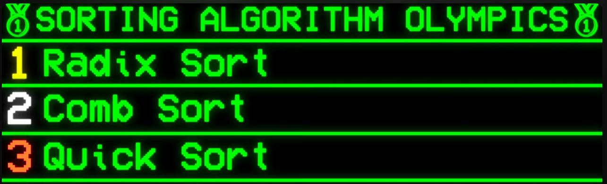

# Race of Sorting Algorithms

Algorithms will be measured by the system time as well as user percieved time to get a proper visualization of the algorithm. What can I say, it's going to be a very short race.

## Algorithms

-   [x] [Bubble Sort](./internal/algorithms/bubble_sort.go)
-   [ ] [Selection Sort]()

## Features

-   [ ] Plugin based architecture
-   [ ] Runs In CLI and possibly in the browser
-   [ ] Visualization with [bubbletea](https://github.com/charmbracelet/bubbletea)

## Installation

```bash
go install github.com/b0sc/sortRace@latest
```

It requires you to have `go` installed in your system, if you do not have it installed, you can download it from [here](https://github.com/b0sc/sortRace/releases).

## Development

```bash
git clone [url]
cd sortRace
make install
make dev # for dev with live reloading
go run . . # for running the application
```

## Contributing

Please refer to our [Contributing Guidelines](./CONTRIBUTING.md) for more information.

## Code of Conduct

Please refer to our [Code of Conduct](./CODE_OF_CONDUCT.md) for more information.

## License

This project is licensed under the GNU General Public License v3.0 - see the [LICENSE](./LICENSE) file for details.

<!--
references:
https://youtu.be/N4JVT3eVBP8?si=43HGVxupM8trzD3H
 -->
